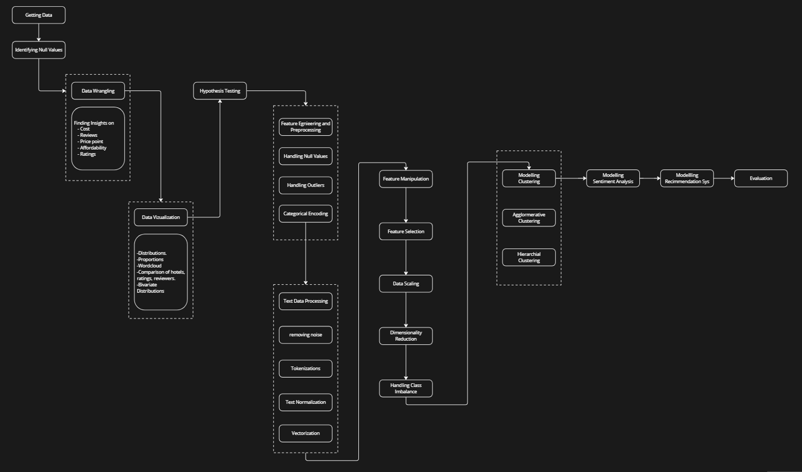

# 🍽️ Zomato Restaurant Clustering and Sentiment Analysis

## 📚 Project Overview

This project analyzes Zomato restaurant data from various cities in India to extract valuable insights about the Indian food industry. The main objectives are to cluster restaurants into segments based on their attributes and analyze customer sentiments from reviews. The insights help customers discover the best restaurants and assist businesses in identifying improvement areas.

---

## 🎯 Problem Statement

The project aims to analyze customer sentiments from reviews and cluster Zomato restaurants into different segments. This analysis will help customers find the best restaurants in their locality and assist the company in identifying areas for improvement. Additionally, the data provides valuable information on cuisine and costs, which can be used for cost vs. benefit analysis.

---

## 📊 Data Description

### 1. Zomato Restaurant Metadata:
- **Name**: Restaurant name  
- **Links**: URL of the restaurant  
- **Cost**: Estimated cost per person  
- **Collection**: Category of restaurant (e.g., “Bar”, “Fine Dining”)  
- **Cuisines**: Type of cuisines served  
- **Timings**: Working hours of the restaurant  

### 2. Zomato Restaurant Reviews:
- **Restaurant**: Restaurant name  
- **Reviewer**: Name of the reviewer  
- **Review**: Review text  
- **Rating**: Rating given by reviewer  
- **MetaData**: Number of reviews and followers of the reviewer  
- **Time**: Timestamp of review  
- **Pictures**: Number of pictures shared with the review  

---

## 🧱 Notebook Breakdown

1. **Business Problem Analysis**  
   Understanding the problem and defining project goals.

2. **Data Collection**  
   Loading and combining restaurant metadata and reviews.

3. **Data Cleaning & Preprocessing**  
   Handling missing data, data type conversions, and merging datasets.

4. **Feature Engineering**  
   Creating new useful features to improve model effectiveness.

5. **Exploratory Data Analysis (EDA)**  
   Visualizing key data insights and patterns.

6. **Top Restaurants in Cities**  
   Analyzing highest-rated restaurants across different cities.

7. **Popular Cuisines in Hyderabad**  
   Exploring cuisine trends specific to Hyderabad.

8. **Cost Distribution of Restaurants**  
   Analyzing how restaurant costs are spread out.

9. **Cost-Benefit Analysis**  
   Comparing restaurant costs with ratings to understand value.

10. **Hypotheses Generation for Clustering**  
    Formulating hypotheses based on visualized data.

---

### High Level Diagram

### ✅ Restaurant Clustering
11. K-Means Clustering based on cost and ratings.  
12. Multi-Dimensional K-Means using various features.  
13. Dimensionality Reduction with Principal Component Analysis (PCA).  
14. Silhouette Score to evaluate clustering quality.  
15. Detailed exploration of clusters to extract insights.

---

### ✅ Sentiment Analysis
16. Sentiment distribution in reviews.  
17. Identifying key critics and influencers.  
18. Text preprocessing and visualization of sentiments.  
19. Sentiment prediction model building and evaluation.

---

### ✅ Recommendation Model
20. Built a recommendation system that suggests restaurants based on the similarity of their review content.
21. Used cosine similarity to calculate a score between every pair of restaurants.
22. Created a user preference profile based on past ratings to make personalized recommendations.

--- 

## ✅ Conclusion

The project successfully analyzed Zomato restaurant data to gain insights into customer sentiments and restaurant segmentation. Key findings include:
-	Identification of top-rated restaurants and popular cuisines in various cities.
-	Cost-benefit analysis of dining options.
-	Clustering of restaurants into distinct segments based on cost, ratings, and other features.
-	Sentiment analysis of customer reviews to understand customer satisfaction and areas for improvement.

---

## 🚀 Future Work

- Improve clustering with advanced algorithms.  
- Add location and demographic data for better insights.  
- Continuously update models with new data for accuracy.

---

## 📂 Dataset Sources

- Zomato Restaurant Metadata  
- Zomato Restaurant Reviews  

---

## ⚡ Technologies Used

- Python (Pandas, NumPy, Scikit-learn)  
- Matplotlib & Seaborn for visualization  
- NLP libraries (NLTK, TextBlob)  
- K-Means clustering and PCA  
- Sentiment classification models

---

## 📧 Contact

Feel free to reach out if you have any questions or suggestions!
